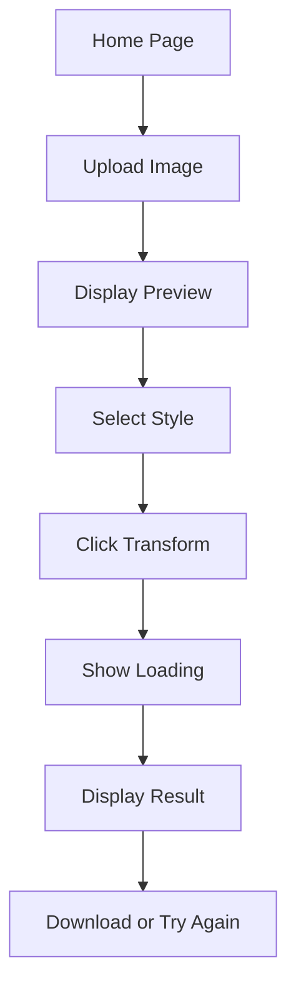

## 1. Product Overview

Nano Banana Image Editor is a fullstack web application that allows users to upload portrait-style images and transform them using AI-powered artistic effects. Users can choose from five different artistic styles including anime, famous painters, and miniature effects.

The application solves the problem of creating artistic transformations of personal photos without requiring professional photo editing skills. It's designed for casual users who want to create unique artistic versions of their portraits for social media, personal use, or creative projects.

## 2. Core Features

### 2.1 User Roles

| Role | Registration Method | Core Permissions |
|------|---------------------|------------------|
| Guest User | No registration required | Upload images, apply transformations, download results |

### 2.2 Feature Module

Our image editor requirements consist of the following main pages:
1. **Home page**: image upload area, style selector, preview section, transformation controls.
2. **Gallery page**: view previously transformed images (optional enhancement).

### 2.3 Page Details

| Page Name | Module Name | Feature description |
|-----------|-------------|---------------------|
| Home page | Image Upload | Drag-and-drop functionality for portrait images, file preview before upload, file validation for image formats |
| Home page | Style Selector | Radio buttons or cards displaying 5 AI transformation effects: Anime Style, Picasso Style, Oil Painting Style, Frida Kahlo Style, Miniature Effect |
| Home page | Preview Section | Side-by-side display of original and transformed images, responsive layout for different screen sizes |
| Home page | Transformation Controls | Transform button to initiate AI processing, loading indicator during processing, clear/reset functionality |
| Home page | Error Handling | User-friendly error messages for upload failures, API errors, and invalid inputs |

## 3. Core Process

### User Transformation Flow
1. User arrives at the homepage and sees the image upload area
2. User drags and drops or clicks to select a portrait-style image
3. Image preview appears showing the uploaded image
4. User selects one of the five available artistic styles
5. User clicks the "Transform" button to start the AI processing
6. Loading indicator appears while the image is being processed
7. Transformed image appears in the preview section alongside the original
8. User can download the transformed image or try a different style

## 4. User Interface Design

### 4.1 Design Style

- **Primary Colors**: Blue (#3B82F6) for primary actions, Gray (#6B7280) for secondary elements
- **Secondary Colors**: White (#FFFFFF) for backgrounds, Dark Gray (#1F2937) for text
- **Button Style**: Rounded corners with hover effects, primary buttons in blue, secondary in gray
- **Font**: System fonts with clear hierarchy - large for headings, medium for body text
- **Layout Style**: Card-based layout with clear sections for upload, selection, and preview
- **Icons**: Simple, modern icons for upload, transform, and download actions

### 4.2 Page Design Overview

| Page Name | Module Name | UI Elements |
|-----------|-------------|-------------|
| Home page | Image Upload | Drag-and-drop zone with dashed border, upload icon, "Choose File" button, file name display |
| Home page | Style Selector | Grid of 5 style cards with preview thumbnails, radio button selection, style names clearly labeled |
| Home page | Preview Section | Split view with original image on left, transformed image on right, image containers with consistent sizing |
| Home page | Action Buttons | Blue "Transform" button with loading spinner, "Clear" button to reset, "Download" button for results |
| Home page | Error Banner | Red alert-style banner at top of page, clear error message, dismissible with X button |

### 4.3 Responsiveness

The application is designed with a desktop-first approach that adapts to mobile devices:
- Desktop: Full split-screen preview, horizontal style selector
- Tablet: Stacked layout with responsive preview sections
- Mobile: Single column layout, touch-optimized controls, swipeable preview carousel
- All interactive elements are touch-friendly with appropriate sizing for mobile interaction