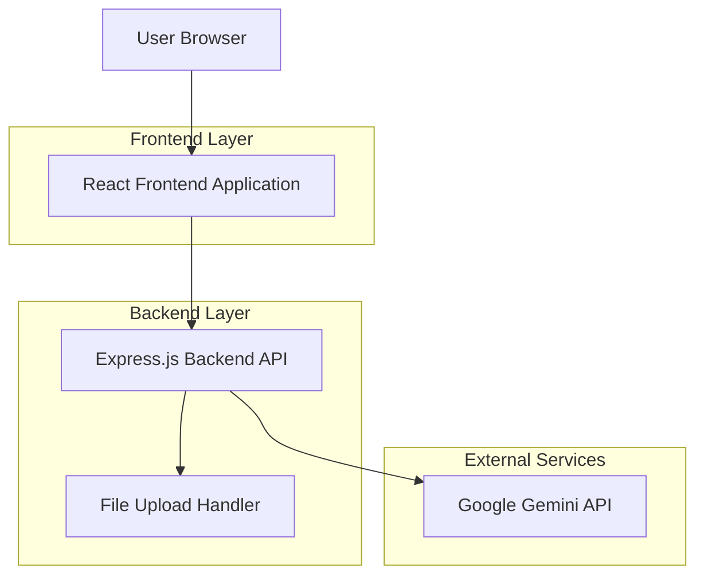
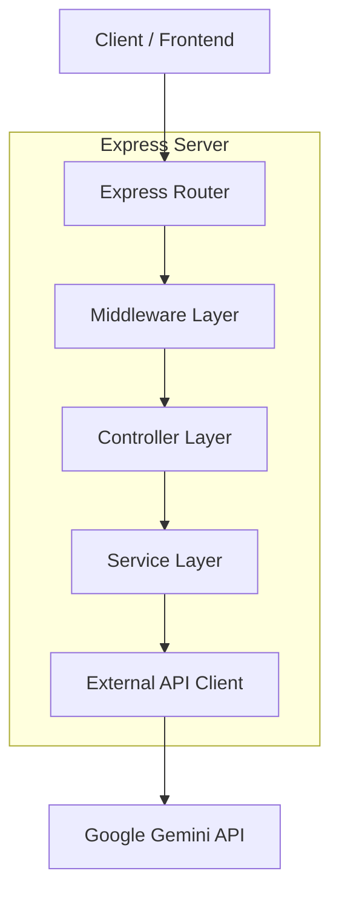

## 1. Architecture Design



## 2. Technology Description

- **Frontend**: React@18 + TailwindCSS@3 + Vite
- **Initialization Tool**: vite-init
- **Backend**: Node.js@18 + Express@4
- **AI Service**: Google Gemini 2.5 Flash Image API
- **File Handling**: Multer for multipart form data
- **Environment Management**: dotenv

## 3. Route Definitions

| Route | Purpose |
|-------|---------|
| / | Home page, displays the main image editor interface |
| /api/transform | POST endpoint for image transformation requests |
| /api/health | Health check endpoint for server status |

## 4. API Definitions

### 4.1 Core API

Image transformation endpoint
```
POST /api/transform
```

Request:
| Param Name| Param Type  | isRequired  | Description |
|-----------|-------------|-------------|-------------|
| image     | File        | true        | The portrait image to transform (JPEG, PNG, max 10MB) |
| style     | string      | true        | One of: "Anime Style", "Picasso Style", "Oil Painting Style", "Frida Kahlo Style", "Miniature Effect" |

Response:
| Param Name| Param Type  | Description |
|-----------|-------------|-------------|
| success   | boolean     | Whether the transformation was successful |
| data      | object      | Contains transformedImage (base64 string) or null |
| error     | string      | Error message if transformation failed |

Example Request:
```javascript
const formData = new FormData();
formData.append('image', fileInput.files[0]);
formData.append('style', 'Anime Style');
```

Example Response:
```json
{
  "success": true,
  "data": {
    "transformedImage": "data:image/png;base64,iVBORw0KGgoAAAANS..."
  },
  "error": null
}
```

## 5. Server Architecture Diagram



## 6. Data Model

### 6.1 File Processing Flow

The application processes images through the following flow:
1. Frontend uploads image via multipart form data
2. Backend validates file type and size
3. Image is converted to base64 for API transmission
4. Gemini API processes the image with selected style prompt
5. Transformed image is returned as base64 string
6. Frontend displays the result in preview section

### 6.2 Style Prompts Configuration

```javascript
const stylePrompts = {
  "Anime Style": "Using the provided image of this person, transform this portrait into pretty, anime style.",
  "Picasso Style": "Using the provided image of this person, transform this portrait into Picasso painting style.",
  "Oil Painting Style": "Using the provided image of this person, transform this portrait into the style of a Degas oil painting.",
  "Frida Kahlo Style": "Using the provided image of this person, transform this portrait into Frida Kahlo painting style.",
  "Miniature Effect": "Create a 1/7 scale commercialized figure of the character in the illustration, in a realistic style and environment. Place the figure on a computer desk, using a circular transparent acrylic base without any text. On the computer screen, display the ZBrush modeling process of the figure. Next to the computer screen, place a BANDAI-style toy packaging box printed with the original artwork."
};
```

## 7. Project Structure

```
nano-banana-image-editor/
├── frontend/
│   ├── src/
│   │   ├── components/
│   │   │   ├── ImageUpload.jsx
│   │   │   ├── StyleSelector.jsx
│   │   │   ├── Preview.jsx
│   │   │   ├── Loader.jsx
│   │   │   └── ErrorBanner.jsx
│   │   ├── services/
│   │   │   └── api.js
│   │   ├── App.jsx
│   │   └── main.jsx
│   ├── public/
│   ├── package.json
│   ├── vite.config.js
│   ├── tailwind.config.js
│   └── postcss.config.js
├── backend/
│   ├── src/
│   │   ├── controllers/
│   │   │   └── transformController.js
│   │   ├── services/
│   │   │   └── geminiService.js
│   │   ├── middleware/
│   │   │   └── upload.js
│   │   ├── routes/
│   │   │   └── api.js
│   │   └── server.js
│   ├── package.json
│   └── .env.example
└── README.md
```

## 8. Environment Configuration

### Frontend Environment Variables
```
VITE_API_URL=http://localhost:3001/api
```

### Backend Environment Variables
```
PORT=3001
GEMINI_API_KEY=your_gemini_api_key_here
MAX_FILE_SIZE=10485760
ALLOWED_FILE_TYPES=image/jpeg,image/png,image/jpg
```

## 9. Error Handling

### Client-Side Errors
- Invalid file format: Display user-friendly message about supported formats
- File size exceeded: Show maximum file size limit
- Network errors: Display connection error with retry option

### Server-Side Errors
- Invalid API key: Return 500 error with configuration message
- Gemini API failures: Return 503 error with service unavailable message
- File processing errors: Return 400 error with specific failure reason

## 10. Security Considerations

- File upload validation for type and size
- Rate limiting on transformation endpoint
- Environment variables for sensitive configuration
- CORS configuration for frontend-backend communication
- Input sanitization for all user inputs